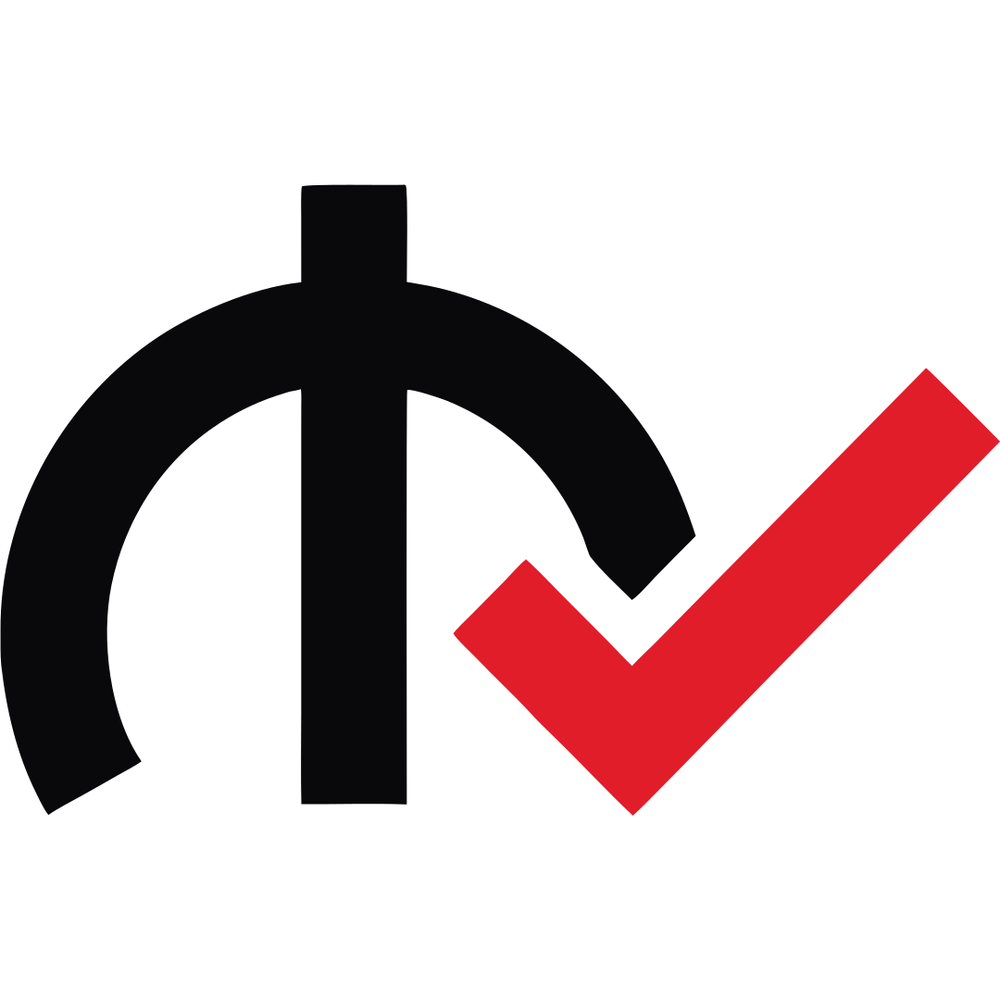
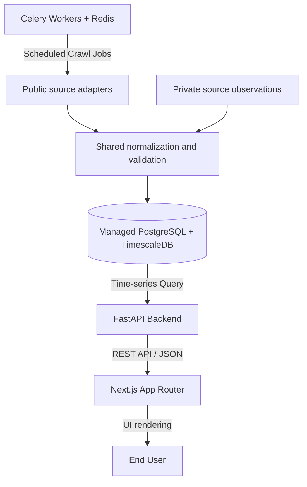

<p align="center">
  <picture>
    <source media="(prefers-color-scheme: dark)" srcset="frontend/public/logo-white.svg">
    <source media="(prefers-color-scheme: light)" srcset="frontend/public/logo.svg">
    
  </picture>
</p>

<h1 align="center">qiymetleri.com</h1>

<p align="center">
  <strong>Real-time price comparison engine for electronics in Azerbaijan.</strong>
</p>

<p align="center">
  <a href="#features">Features</a> •
  <a href="#architecture">Architecture</a> •
  <a href="#open-source-boundary">Open-source boundary</a> •
  <a href="#project-structure">Project Structure</a> •
  <a href="#getting-started">Getting Started</a>
</p>

---

## Overview

**qiymetleri.com** is a real-time electronics price comparison and objective
specification platform for Azerbaijan. It crawls configured retailers,
normalizes equivalent products, tracks price history, and builds auditable
model/variant specifications for AZ/RU comparison experiences.

The application code, taxonomy, validators, and synthetic fixtures are public.
Production catalogue data, price history, source payloads, retailer artwork,
and deployment secrets are intentionally excluded.

## Features

- **Source adapters:** Scrapy and Playwright adapters with explicit scheduling,
  proxy, and rate-limit configuration.
- **Product normalization:** Shared model identity and canonical variant logic.
- **Price history:** PostgreSQL/TimescaleDB storage for current and historical
  offers.
- **Specification governance:** Typed values, source precedence, conflict
  moderation, audit history, and readiness gates.
- **Localization:** Azerbaijani and Russian interfaces through `next-intl`.
- **Responsive interface:** Next.js, React, and Tailwind CSS.

---

## Architecture

The project follows a decoupled, service-oriented architecture:



---

## Tech Stack

| Layer | Technologies |
| :--- | :--- |
| **Frontend** | Next.js 16 (App Router), React 19, TypeScript, Tailwind CSS v4, `next-intl` (i18n), Base UI |
| **Backend** | FastAPI, SQLAlchemy 2.0, Pydantic v2, Poetry, Alembic |
| **Database** | PostgreSQL + TimescaleDB (for efficient price-history hypertables) |
| **Scraping** | Scrapy, Playwright (for JS rendering), Celery |
| **Cache & Queue** | Redis, Celery Workers |
| **Development** | Docker, Docker Compose, Nginx (local reverse proxy) |

---

## Open-source boundary

The public repository is the reusable application core. It contains no
production database, real pilot snapshot, one-off source payload, credential,
or production environment file.

> [!IMPORTANT]
> `private/` is an ignored local overlay. Never force-add files from it.
> Database and data rights are separate from the software licence; see
> [the boundary](docs/OPEN_SOURCE_BOUNDARY.md) and
> [data policy](DATA_LICENSE.md) before publishing a dataset.

Before a commit or release, run:

```bash
./scripts/check-public-release.sh
```

The same audit runs in CI and rejects secret-like values, real data artefacts,
third-party retailer artwork, and files crossing the private boundary.
Create a history-free source archive with `./scripts/export-public-release.sh`
and follow [the publication checklist](docs/PUBLICATION.md) before changing any
repository visibility.

---

## Project Structure

```
qiymetleriV2/
├── backend/              # Public FastAPI application, migrations, and tests
├── frontend/             # Public Next.js web application
├── scraper/              # Public source adapter framework
├── shared/               # Public normalization, taxonomy, and synthetic fixtures
├── scripts/              # Public release audit/export commands
├── docs/                 # Architecture, governance, demo, and deployment guides
├── private/              # Ignored local data and production overlay
└── docker-compose.yml    # Public local-development template
```

> [!NOTE]
> The frontend implements a strict **colocation pattern**. Components used by exactly one page/route are kept next to that page (e.g. in `_components/`), rather than in the global `src/components/` folder.

---

## Getting Started

### Running with Docker

To start the full application stack:

1. **Create the local environment file and replace every `CHANGE_ME` value:**
   ```bash
   cp .env.example .env
   ```

2. **Build and start PostgreSQL, Redis, migrations, API, frontend, and workers:**
   ```bash
   docker compose up -d --build
   ```

3. **Optionally load the deterministic diploma demonstration catalogue:**
   ```bash
   docker compose --profile demo run --rm seed-demo
   ```

4. **Verify the stack:**
   ```bash
   curl http://localhost:8000/health/ready
   ```

5. **Access the services:**
   - Frontend: `http://localhost:3000`
   - FastAPI Docs: `http://localhost:8000/docs`
   - Nginx entrypoint: `http://localhost`

> [!WARNING]
> `docker compose down -v` permanently deletes local PostgreSQL and Redis volumes. Use it only when intentionally creating a fresh environment.

Detailed procedures are available in [the demo runbook](docs/DEMO.md) and [the deployment guide](docs/DEPLOYMENT.md).

---

### Manual installation

If you prefer to run services individually without Docker:

#### 1. Database & Cache
Ensure you have **PostgreSQL** (with TimescaleDB extension installed) and **Redis** running locally. Set up your environment variables by copying `.env.example` configurations.

#### 2. Backend (FastAPI)
```bash
cd backend
poetry install
alembic upgrade head
uvicorn app.main:app --reload --host 0.0.0.0 --port 8000
```

#### 3. Frontend (Next.js)
```bash
cd frontend
npm ci
npm run dev
```

#### 4. Scraper (Scrapy)
```bash
cd scraper
poetry install
playwright install chromium   # Required on first installation
scrapy crawl kontakt_home     # Run a spider manually
```

> [!IMPORTANT]
> The Celery scraping workers require the `--pool=solo` flag on Windows/macOS to ensure Playwright's browser automation contexts initialize successfully.

---

## Quality checks

Run these checks before committing:

```bash
./scripts/check-public-release.sh
PYTHONPATH=backend:. .venv/bin/python -m pytest backend/tests shared/tests -q
.venv/bin/ruff check backend shared scraper
.venv/bin/black --check backend/scripts shared/tests
cd frontend && npm run lint && npm run build
```

Security issues should be reported privately according to
[SECURITY.md](SECURITY.md). General changes follow
[CONTRIBUTING.md](CONTRIBUTING.md).
