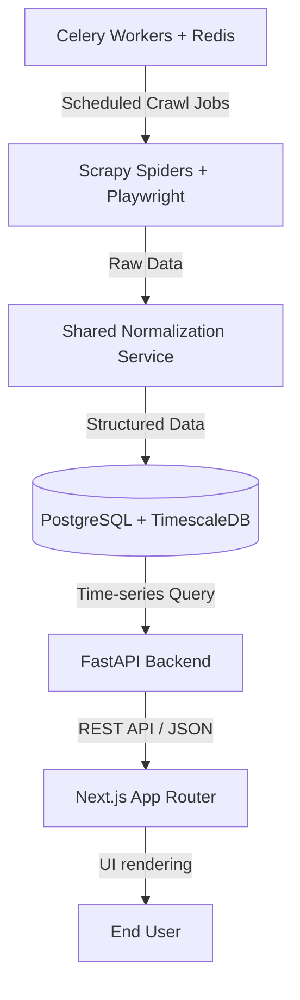

<p align="center">
  <picture>
    <source media="(prefers-color-scheme: dark)" srcset="frontend/public/logo-white.svg">
    <source media="(prefers-color-scheme: light)" srcset="frontend/public/logo.svg">
    
  </picture>
</p>

<h1 align="center">qiymetleri.com</h1>

<p align="center">
  <strong>Real-time price comparison engine for electronics in Azerbaijan.</strong>
</p>

<p align="center">
  <a href="#features">Features</a> •
  <a href="#architecture">Architecture</a> •
  <a href="#tech-stack">Tech Stack</a> •
  <a href="#project-structure">Project Structure</a> •
  <a href="#getting-started">Getting Started</a>
</p>

---

## Overview

**qiymetleri.com** is a modern, real-time price comparison application designed specifically for the electronics market in Azerbaijan. It automatically crawls, normalizes, and aggregates product pricing information from major electronic retailers (Kontakt Home, Baku Electronics, Irshad Electronics, and iSpace), offering users up-to-date deals and historical price tracking.

This project is a clean rewrite focused on high-quality code organization, proper database modeling using TimescaleDB for price histories, localization support (AZ/RU), and clean colocation of components.

## Features

- 🕷️ **Real-time Crawling**: Store-specific web scrapers built with Scrapy and Playwright to fetch accurate prices and bypass modern JS-based anti-bot protection.
- 🔄 **Product Normalization**: Intelligent parsing and linking of product models across different stores using a shared python module.
- 📈 **Price History**: Historical price tracking utilizing Postgres + TimescaleDB hypertables for optimized time-series querying.
- 🌐 **Localization**: Native support for both Azerbaijani (`az`) and Russian (`ru`) languages using `next-intl`.
- ⚡ **Modern UI/UX**: Responsive web application styled with Tailwind CSS v4 and polished shadcn / Base UI primitives.

---

## Architecture

The project follows a decoupled, service-oriented architecture:



---

## Tech Stack

| Layer | Technologies |
| :--- | :--- |
| **Frontend** | Next.js 16 (App Router), React 19, TypeScript, Tailwind CSS v4, `next-intl` (i18n), Base UI |
| **Backend** | FastAPI, SQLAlchemy 2.0, Pydantic v2, Poetry, Alembic |
| **Database** | PostgreSQL + TimescaleDB (for efficient price-history hypertables) |
| **Scraping** | Scrapy, Playwright (for JS rendering), Celery |
| **Cache & Queue** | Redis, Celery Workers |
| **Development** | Docker, Docker Compose, Nginx (local reverse proxy) |

---

## Project Structure

```
qiymetleriV2/
├── frontend/             # Next.js web application (TypeScript, Tailwind CSS v4)
├── backend/              # FastAPI application (SQLAlchemy models, Schemas, Migrations)
├── scraper/              # Scrapy scraper & Playwright integration
├── shared/               # Shared Python package (product normalization & helper utils)
└── docker-compose.yml    # Main Docker Compose configuration
```

> [!NOTE]
> The frontend implements a strict **colocation pattern**. Components used by exactly one page/route are kept next to that page (e.g. in `_components/`), rather than in the global `src/components/` folder.

---

## Getting Started

### 🐳 Running with Docker (Recommended)

To spin up the entire application stack (Frontend, Backend, DB, Redis, and workers):

1. **Build and start the application:**
   ```bash
   docker compose build frontend && docker compose up -d
   ```
2. **Access the services:**
   - Frontend: `http://localhost:3000`
   - FastAPI Docs: `http://localhost:8000/docs`

> [!TIP]
> For subsequential runs, hot reloading is enabled. Simply use `docker compose up -d` without rebuilding.

---

### 🛠️ Manual Installation (For Local Development)

If you prefer to run services individually without Docker:

#### 1. Database & Cache
Ensure you have **PostgreSQL** (with TimescaleDB extension installed) and **Redis** running locally. Set up your environment variables by copying `.env.example` configurations.

#### 2. Backend (FastAPI)
```bash
cd backend
poetry install
alembic upgrade head
uvicorn app.main:app --reload --host 0.0.0.0 --port 8000
```

#### 3. Frontend (Next.js)
```bash
cd frontend
pnpm install
pnpm dev
```

#### 4. Scraper (Scrapy)
```bash
cd scraper
poetry install
playwright install chromium   # Required on first installation
scrapy crawl kontakt_home     # Run a spider manually
```

> [!IMPORTANT]
> The Celery scraping workers require the `--pool=solo` flag on Windows/macOS to ensure Playwright's browser automation contexts initialize successfully.

---

## Linting & Formatting

Always format and type-check your code before committing:

- **Backend / Scraper**: `cd backend && ruff check . && black --check .`
- **Frontend**: `cd frontend && pnpm lint`
